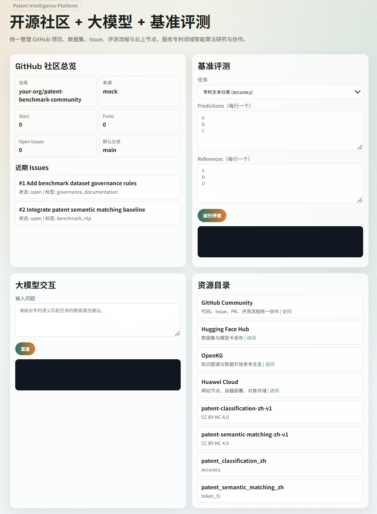

# Patent Intelligence Open Benchmark Platform

面向“专利领域常见任务智能算法评测 + 开源社区协作”的微服务平台初版。  
该工程重点覆盖你提出的 4 个目标：



1. GitHub 集成与社区建设
2. UI 与功能设计（含大模型能力与基准评测）
3. 平台搭建（容器化、云上部署）
4. 文档与资源管理（参考 OpenKG / Hugging Face 生态）

## 1. 项目结构

```text
.
├─ .github/
│  ├─ ISSUE_TEMPLATE/
│  └─ workflows/
├─ benchmarks/                 # 评测任务与示例配置
├─ docs/                       # 架构、部署、治理文档
├─ frontend/                   # 平台 UI（静态页面）
├─ resources/                  # 数据集/工具/规范目录
├─ services/
│  ├─ api-gateway/             # 统一 API 网关 + 前端托管
│  ├─ community-service/       # GitHub 社区与 Issue 聚合
│  ├─ benchmark-service/       # 基准任务与评分逻辑
│  ├─ llm-service/             # 大模型推理接入（OpenAI 兼容）
│  └─ resource-service/        # 资源目录与贡献规范
├─ docker-compose.yml
└─ .env.example
```

## 2. 快速启动

1. 复制环境变量模板：

```bash
cp .env.example .env
```

2. （可选）在 `.env` 填写 GitHub 仓库和模型 API 配置。

3. 启动服务：

```bash
docker compose up --build
```

4. 访问平台：

- UI: `http://localhost:8080/`
- API 健康检查: `http://localhost:8080/api/health`

## 2.1 公网访问（开源社区推荐）

项目支持公网部署，不是只能本地访问。  
如果你要让所有人访问你的社区，推荐使用 `Caddy + Docker Compose`：

```bash
docker compose -f docker-compose.yml -f docker-compose.public.yml up -d --build
```

详细步骤见：
- `docs/public-deployment.md`

## 3. 核心能力

- 统一管理 GitHub 仓库信息、Issues、任务状态
- 社区首页四大模块：`文献任务榜`、`AI前沿`、`开源分享`、`主题论坛`
- 内置 openKG-field 组织仓库联动，可一键跳转 GitHub 查看详细内容
- 支持 PDF 内容提取后的结构化入库（示例见 `docs/extracted/`）
- 统一展示任务基线、提交预测并返回评测分数
- 集成大模型对话接口（OpenAI 兼容 API，可接入免费模型渠道）
- 统一管理数据集与工具资源（GitHub / Hugging Face / OpenKG 风格目录）
- 管理员新增内容支持后端 SQLite 持久化（非浏览器本地存储）
- 开箱即用的开源社区模板（Issue / PR / CI）

## 4. 对应四项需求的落地说明

- `GitHub 集成与社区建设`：`community-service` + `.github` 模板 + workflow
- `UI 与功能设计`：`frontend` + `api-gateway` 聚合 API
- `平台搭建`：`docker-compose.yml` + `docs/huaweicloud-deployment.md`
- `文档与资源管理`：`docs/community-governance.md` + `resources/catalog.json`

文档索引：

- `docs/platform-architecture.md`
- `docs/github-integration-checklist.md`
- `docs/huaweicloud-deployment.md`
- `docs/public-deployment.md`
- `docs/community-governance.md`

## 5. 后续扩展建议

- 增加异步评测队列（Celery/RabbitMQ/Kafka）
- 评测结果持久化（PostgreSQL + MinIO/OBS）
- 引入任务排行榜自动发布与月度社区报告
- 增加模型插件协议（本地模型、云上 API、Hugging Face Inference Endpoint）
CI trigger test
